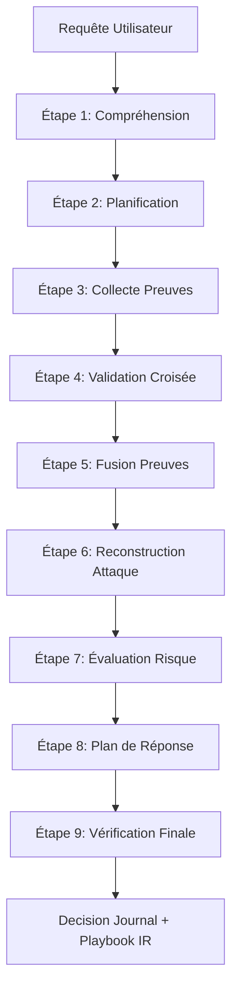

# Architecture Technique — AI Security Council v2

Ce document décrit l'architecture multi-agent de la version 2 du **AI Security Council** de la plateforme **SecureRAG Hub**.

---

## 1. Vue d'Ensemble & Pipeline de Raisonnement

L'AI Security Council est orchestré par un **Master AI Reasoning Engine** qui structure le raisonnement de sécurité en 9 étapes séquentielles. Cette structure garantit que les chain-of-thought internes et bruts des modèles ne soient jamais exposés à l'utilisateur final. À la place, l'utilisateur a accès à un **Journal de Décision** et à des traces explicables et auditables.

---

## 2. Les 9 Étapes du Master AI Reasoning Engine

1. **Query Comprehension** : Analyse et classification automatique de la requête via `QueryClassifierAgent`.
2. **Expert Planning** : Sélection intelligente des experts les plus qualifiés en fonction du domaine (phishing, malware, cloud, kubernetes, devsecops).
3. **Evidence Collection** : Exécution parallèle et asynchrone des analyses par les experts (modèles GPU et experts virtuels).
4. **Cross-Validation & Contradictions** : Validation mutuelle des experts pour détecter les contradictions et les zones de doute.
5. **Evidence Fusion** : Agrégation et déduplication des preuves, IOCs et techniques MITRE.
6. **Attack Reconstruction** : Cartographie des techniques identifiées sur la chaîne de cyber-attaque (MITRE ATT&CK).
7. **Risk Assessment** : Calcul d'un score de risque composite (Probabilité × Impact) avec génération du vecteur CVSS.
8. **Response Plan Generation** : Création d'un playbook de remédiation en 4 phases (confinement, éradication, récupération, prévention).
9. **Final Verification & Reflection** : Évaluation de la cohérence de la décision et de la qualité des références.

---

## 3. Les 15 Agents Experts Spécialisés (Zéro GPU supplémentaire)

Pour analyser précisément chaque domaine de la cybersécurité sans saturer la VRAM du serveur, l'architecture intègre **15 agents experts virtuels** exécutés en pur Python, combinant règles d'heuristiques, expressions régulières et interrogation de la base de connaissances locale (RAG) :

| ID Expert | Nom | Domaine principal |
| :--- | :--- | :--- |
| `phishing_expert` | Phishing Analyst | Tentatives d'hameçonnage, ingénierie sociale |
| `email_header_expert` | Email Protocol Analyst | En-têtes, configurations SPF/DKIM/DMARC |
| `malware_expert` | Malware Analyst | Signatures comportementales de payloads/scripts |
| `threat_intel_expert` | Threat Intelligence Analyst | Groupes d'APT, TTPs et campagnes de menaces |
| `ioc_expert` | IOC Specialist | Extraction et classification de réputation d'indicateurs |
| `mitre_expert` | MITRE ATT&CK Analyst | Cartographie et tactiques du framework MITRE |
| `sigma_expert` | Sigma Rules Analyst | Génération et corrélation de règles de détection |
| `incident_response_expert` | IR & DFIR Specialist | Playbooks opérationnels et forensique de triage |
| `soc_analyst_expert` | SOC Triage Analyst | Triage, priorisation d'alertes (P1-P4) |
| `rag_knowledge_expert` | Knowledge Base Analyst | Interrogation de la base RAG locale indexée |
| `vulnerability_expert` | Vulnerability Analyst | Analyse de CVE, calcul de scores CVSS |
| `cloud_security_expert` | Cloud Security Analyst | Misconfigurations d'infrastructures AWS/Azure/GCP |
| `kubernetes_security_expert` | K8s Security Analyst | RBAC, Pod Security, et Network Policies K8s |
| `devsecops_expert` | DevSecOps Analyst | Secrets exposés dans le code, pipelines CI/CD |
| `risk_assessment_virtual_expert` | Risk Assessment Expert | Risques d'impact métier et conformité réglementaire |

---

## 4. Composants Clés du Backend

- **`types.py`** : Définit les contrats de données (`ReasoningTrace`, `AttackTimeline`, `RiskAssessment`, `ResponsePlan`, `DecisionJournal`).
- **`attack_timeline.py`** : Reconstruit la chronologie de l'attaque.
- **`risk_assessment.py`** : Calcule le score de risque composite (0-100).
- **`response_plan.py`** : Détermine le playbook IR adapté.
- **`evidence_fusion.py`** : Gère la déduplication et l'évaluation de richesse de l'analyse.
